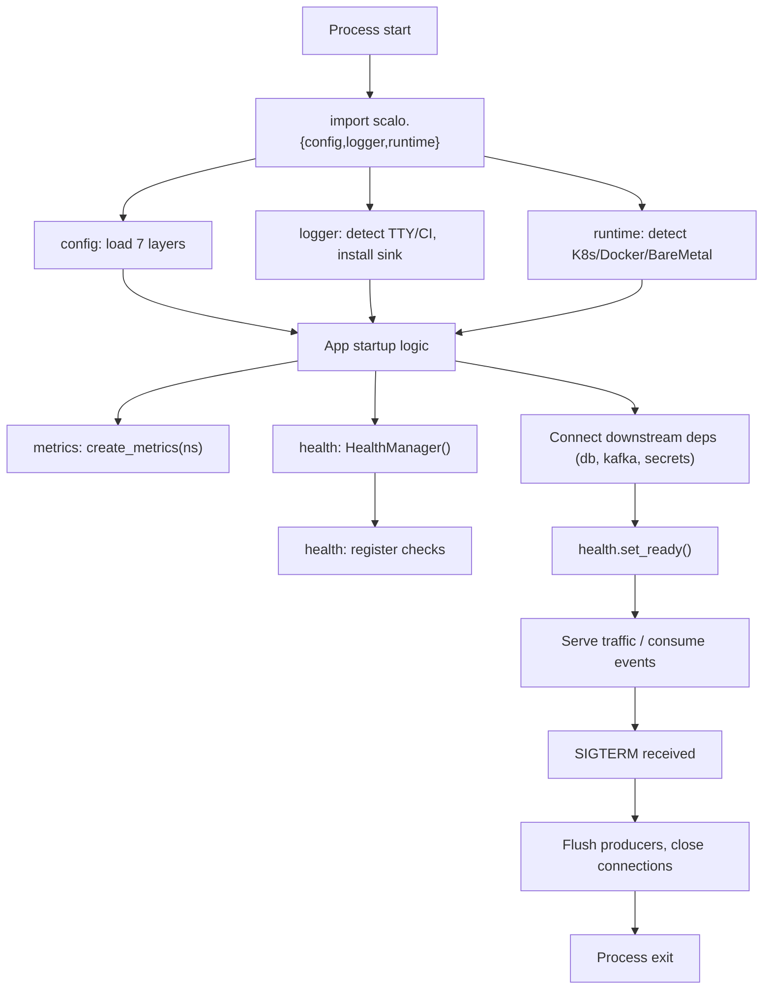

# Auto-wiring

What scalo-py does automatically when you import a module, versus what
you wire by hand. The principle: opinionated defaults that just work,
escape hatches when you need them.

The deprecated `Application` framework was the scalo-rs-style "wire
everything from one call" entry point. It's gone. Pylib's auto-wiring
is now per-module and happens at first use.

---

## What's automatic

| Module | Wired at | What's automatic |
|---|---|---|
| `config` | First `from scalo.config import settings` | Dynaconf cascade construction, `.env` loading, sensitive masking, `RuntimePaths.config_dir` selection |
| `logger` | First import | Loguru sink installed, JSON/text autodetect (TTY vs not), RFC 3339 format, level from `LOG_LEVEL` env (default INFO), scrub filters loaded from `data/gitleaks.toml` + `data/national_ids.toml`, CI mode autodetect (GitHub Actions / GitLab CI / Jenkins) for ASCII-only output |
| `runtime` | First `get_runtime_paths()` call | K8s / Docker / BareMetal detection (7 indicators), path-set materialisation, `CONTAINER_BASE_PATH` env override |
| `metrics` | First `create_metrics(namespace)` call | Backend selection (OTel default, Prometheus fallback if OTel not installed), `MetricsManager` content + content-type for the observability server (or an app-served route), process collector (RSS, CPU, FDs via psutil). The cardinality cap is NOT automatic -- see [core-pillars/METRICS.md](core-pillars/METRICS.md) |
| `health` | First `HealthManager()` instantiation | Probe handlers ready; `/livez` is unconditionally 200; `/readyz` returns 503 until `set_ready()` is called and all registered downstream checks pass |
| scrub metrics | `ServiceApp` `run`, once the metrics manager exists | The log scrub layers emit `log_scrub_matches_total` / `redactions` / `errors` / `skipped` / `duration` / `pattern_version` (spec 8, parity manifest). `ServiceApp` re-runs `logger.setup(metrics=...)` after `create_metrics` to wire it; outside `ServiceApp` pass `metrics=` to `setup()` yourself, or the layers stay no-op. Honours `scrub.metrics_enabled` and `scrub.metrics_type_cardinality_cap` |
| observability port | `ServiceApp` `run` (unless `serve_observability = False`) | Binds `--metrics-addr` (default `0.0.0.0:9090`) and serves `/metrics`, `/livez` and `/readyz` -- and nothing else -- off `app.health()` and the auto-initialised metrics manager. A bind failure is fatal by design |
| `version_check` | `check_on_startup(product, version)` call | Daemon thread fires-and-forgets a probe to HyperI version API; never blocks, never raises |
| `secrets` | `SecretsManager.from_config(...)` | Provider class selected from `settings.secrets.provider`; backend extras (`secrets-vault`, `secrets-aws`, etc.) imported lazily |

---

## What's manual

| Concern | You wire | Why not automatic |
|---|---|---|
| FastAPI server with `/health/*` router | `app.include_router(create_health_router(...))` | Pylib doesn't own your HTTP framework. `/metrics` is served by the app using `MetricsManager.content` + `content_type` (see core-pillars/METRICS.md). No `/config` router ships |
| Kafka producer flush on shutdown | `producer.flush()` in your signal handler | Producer lifecycle is app-specific; we don't intercept SIGTERM |
| Circuit breaker around a downstream | `with CircuitBreaker(config): call()` | Failure modes vary per downstream; sensible defaults exist but explicit is better |
| Metric registration | `m.counter(name, help, labels)` per metric | Metrics are app-specific; we provide the framework, not the catalogue |
| Application class / runtime entry point | Nothing — compose modules directly | The `Application` framework was experimental and deprecated; production code uses the modules directly |

---

## You-get-this-for-free matrix

Read top-to-bottom: install the extra in the first column, get every
"automatic" item from every row above it for free.

| Install | Adds | Automatic |
|---|---|---|
| `scalo` (base) | `config`, `logger`, `runtime`, `cli`, `health`, `version_check`, `concurrency` | Cascade, structured logs, path detection, version probe |
| `scalo[metrics]` | `metrics` + `prometheus-client` + `psutil` + OTel SDK/exporters | Above + the default OTel backend: OTLP push AND `MetricsManager.content` for the observability server or an app-served `/metrics` route + process collector (cardinality cap is opt-in) |
| `scalo[opentelemetry]` | OTel SDK + exporters | Subset of `[metrics]`, kept for existing pins |
| `scalo[http]` | `http` + `httpx` + `stamina` + `purgatory` | Above + HTTP client with retry + circuit breaker + metrics integration |
| `scalo[kafka]` | `kafka` + `confluent-kafka` + `genson` | Above + producer/consumer/admin + schema sampling. Consumer-lag health is MANUAL: `KafkaConsumer` does not install the statistics callback, so `KafkaConsumerHealth` and the `kafka.health.*` keys stay inert until the app wires `create_stats_callback` itself |
| `scalo[secrets-{vault,aws,gcp,azure,ansible-vault}]` | `secrets` provider | Above + uniform interface, lazy-loaded provider |
| `scalo[deployment]` | `deployment` + `pydantic` | Above + `DeploymentContract` + generators + `ContractIdentity` + `test_support` |
| `scalo[expression]` | `expression` + `common-expression-language` | Above + CEL evaluation (Python/Rust parity via PyO3) |
| `scalo[resilience]` | `resilience` + `stamina` + `purgatory` | Above + standalone circuit breaker (already pulled in by `http`/`secrets-*`) |

---

## Lifecycle

Three points:

- The import-time work is cheap (no I/O except cascade file reads).
  Apps can `import scalo.config` from a `__init__.py` without
  startup latency surprises.
- `set_ready()` is explicit, not inferred. Until you call it, `/readyz`
  returns 503 — which is the desired K8s rolling-update behaviour.
- SIGTERM handling is the app's job. We expose `concurrency` primitives
  (cancellation tokens, bulkheads) but don't install signal handlers
  on import.

---

## Related

- [README.md](README.md)
- [architecture.md](architecture.md)
- [INTEGRATION.md](INTEGRATION.md)
- [EXTRAS-FLAGS.md](EXTRAS-FLAGS.md)
- [core-pillars/CONFIG.md](core-pillars/CONFIG.md)
- [core-pillars/HEALTH.md](core-pillars/HEALTH.md)
