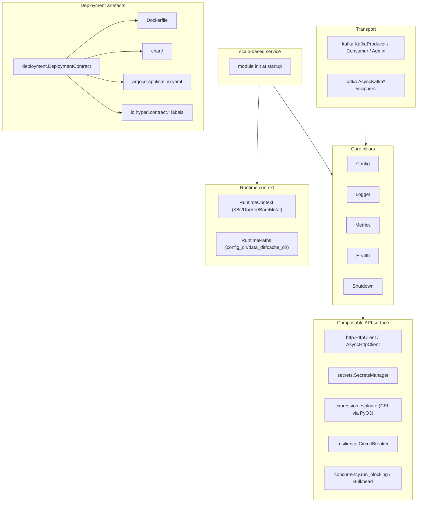

# scalo docs

Batteries-included Python library for building services. Import the modules
you need, configure them once, and you get a 7-layer config cascade,
structured logs, Prometheus + OTel metrics, K8s health probes, secrets
management, resilience primitives, a Kafka client, and deployment-artefact
generation — all opinionated, all production-tested.

This is the index. Read [architecture.md](architecture.md) for the
10,000-foot view, [INTEGRATION.md](INTEGRATION.md) for a recipe to build
a scalo-based service, [AUTO-WIRING.md](AUTO-WIRING.md) for the "you get
this for free" model, and [EXTRAS-FLAGS.md](EXTRAS-FLAGS.md) for which
Python extras pull in which deps.

---

## What you get for free

| Import this | And these come along | No need to |
|-------------|----------------------|------------|
| `from scalo import config` | 7-layer cascade, env-var nesting, `.env`, sensitive masking | Wire dynaconf, write a settings loader |
| `from scalo import logger` | Loguru-backed structured logs, JSON unless stderr is a TTY, keyword fields in every format, RFC 3339 timestamps, gitleaks-based secret scrubbing, rate-limit filter, emoji-to-text for CI | Install loguru, format JSON, hand-roll a scrubber |
| `from scalo import metrics` | Prometheus + OpenTelemetry dual backend, `MetricsManager` content + content-type for an app-served `/metrics` route, process collector, cardinality cap, metric groups (consumer/sink/buffer/circuit-breaker) | Stand up an exporter, wire a process collector, hand-roll a cardinality limiter |
| `from scalo import health` | `/livez` and `/readyz` router, downstream-dep registry, K8s-shaped responses | Write probe handlers, manage dependency state |
| `from scalo import runtime` | K8s / Docker / bare-metal autodetect, container-aware paths (config_dir, data_dir, cache_dir, run_dir), `CONTAINER_BASE_PATH` override | Read `/.dockerenv`, parse cgroups, pick path defaults |
| `from scalo import secrets` | OpenBao / Vault / AWS / GCP / Azure / ansible-vault / file providers behind one interface | Pick a provider SDK, wrap each behind a uniform API |
| `from scalo.deployment import DeploymentContract` | Pydantic contract → Dockerfile + Helm chart + ArgoCD Application + container manifest + Compose fragment, all carrying [Contract Identity v1](deployment/IDENTITY.md) labels | Write the generators yourself, keep them in sync, stamp identity by hand |
| `from scalo.kafka import KafkaProducer, KafkaConsumer` | confluent-kafka clients with at-least-once producer defaults, schema sampling, consumer lag health, async wrappers | Configure librdkafka, hand-roll a retry wrapper, write a lag probe |

That's the value proposition. Everything else is "and here's how the
pieces work".

---

## 10,000-foot view

---

## Where to read what

### Start here

- [architecture.md](architecture.md) — module map, dependency graph, layering
- [INTEGRATION.md](INTEGRATION.md) — "I'm building a scalo service" recipe
- [AUTO-WIRING.md](AUTO-WIRING.md) — what's wired automatically, what's manual
- [EXTRAS-FLAGS.md](EXTRAS-FLAGS.md) — extras tree, recommended bundles, native deps
- [migrations.md](migrations.md) -- behaviour and API changes a consumer adjusts for, by release

### Core pillars (always available)

- [core-pillars/CONFIG.md](core-pillars/CONFIG.md) — 7-layer cascade, registry, sensitive masking
- [core-pillars/LOGGING.md](core-pillars/LOGGING.md) — loguru setup, JSON/text autodetect, fields, JSON record shape, scrub, rate-limit, CI mode
- [core-pillars/METRICS.md](core-pillars/METRICS.md) — Prometheus + OTel dual, metric groups, cardinality cap
- [core-pillars/TRACING.md](core-pillars/TRACING.md) — OTLP span export, sampling, backoff when the collector is absent
- [core-pillars/HEALTH.md](core-pillars/HEALTH.md) — `HealthManager`, `/livez` / `/readyz`
- [core-pillars/SHUTDOWN.md](core-pillars/SHUTDOWN.md) — SIGTERM handling, K8s pre-stop delay

### Runtime

- [runtime/RUNTIME-CONTEXT.md](runtime/RUNTIME-CONTEXT.md) — K8s/Docker/BareMetal detection, container-aware paths
- [runtime/SERVICE-RUNTIME.md](runtime/SERVICE-RUNTIME.md) — composable-modules pattern (the `Application` framework is deprecated)

### Transport

- [transport/KAFKA.md](transport/KAFKA.md) — producer, consumer, admin, async wrappers, schema sampling, lag health

### Deployment

- [deployment/CONTRACT.md](deployment/CONTRACT.md) — `DeploymentContract` Pydantic model, schema versioning
- [deployment/ARTEFACTS.md](deployment/ARTEFACTS.md) — Dockerfile / Helm chart / ArgoCD Application / Compose
- [deployment/NATIVE-DEPS.md](deployment/NATIVE-DEPS.md) — `NativeDepsContract`, extras → APT package map
- [deployment/KEDA.md](deployment/KEDA.md) — `KedaContract`, scaler triggers, fallback HPA
- [deployment/IDENTITY.md](deployment/IDENTITY.md) — Contract Identity Annotation Scheme v1
- [deployment/TEST-SUPPORT.md](deployment/TEST-SUPPORT.md) — e2e probes, skip helper, `KindClusterGuard`

### API modules

- [api/SECRETS.md](api/SECRETS.md) — OpenBao / Vault / AWS / GCP / Azure / ansible-vault / file
- [api/HTTP-CLIENT.md](api/HTTP-CLIENT.md) — `HttpClient` + `AsyncHttpClient` with retries + circuit breaker
- [api/CONCURRENCY.md](api/CONCURRENCY.md) — `run_blocking`, `Bulkhead`, `gather_with_timeouts`
- [api/DIRECTORY-CONFIG.md](api/DIRECTORY-CONFIG.md) — YAML directory store with optional git tracking
- [api/EXPRESSION.md](api/EXPRESSION.md) — CEL via Rust/PyO3 (Python/Rust evaluation parity)
- [api/RESILIENCE.md](api/RESILIENCE.md) — `CircuitBreaker` Closed/Open/HalfOpen
- [api/VERSION-CHECK.md](api/VERSION-CHECK.md) — Non-blocking startup version probe
- [api/SCALING.md](api/SCALING.md) — `ScalingPressure` composite score for KEDA
- [api/CLI.md](api/CLI.md) — Typer-based CLI framework, `ServiceApp`, standard options

---

## Project facts

- **Package:** [scalo](https://pypi.org/project/scalo/) (PyPI)
- **Python:** >=3.14
- **Sibling lib:** [scalo-rs](https://github.com/hyperi-io/scalo-rs) (Rust equivalent; same subdir layout where the concept maps 1:1)
