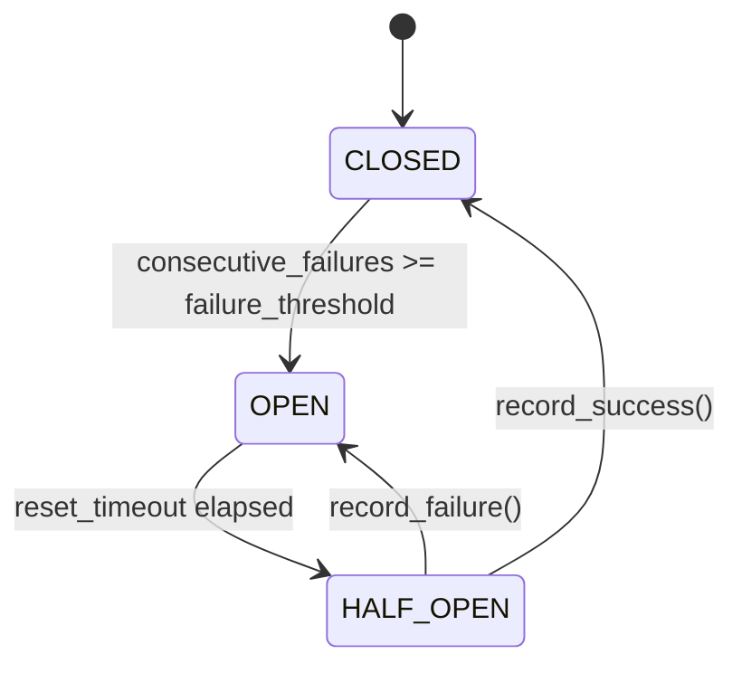

# Resilience

Two complementary primitives, both in the base package (no extras to
install):

- `CircuitBreaker` — trip-and-reject a one-shot outbound call. Matches
  `scalo-rs`'s `src/resilience/circuit_breaker.rs` byte for byte: same
  three-state machine (CLOSED / OPEN / HALF_OPEN), same thresholds,
  same semantics — a service rewritten from Python to Rust trips and
  recovers identically.
- `ReconnectingResilience` — reconnect and retry a pooled connection
  through a transient outage, until it recovers or a budget runs out.
  The sibling shape for a dependency you hold a pool against (a
  ClickHouse client today, another pooled backend tomorrow) rather
  than a single request/response call. No `scalo-rs` equivalent exists
  yet — see "Cross-language parity" below.

```python
from scalo.resilience import (
    CircuitBreaker, CircuitBreakerConfig, CircuitBreakerError, CircuitState,
    ReconnectingResilience, ResilienceConfig, ServiceUnavailable, OutageState,
)
```

---

## Quick start

```python
cb = CircuitBreaker("payments", CircuitBreakerConfig(failure_threshold=3))

with cb:
    response = call_downstream()  # raises CircuitBreakerError if OPEN
```

---

## State machine



| State | Behaviour |
|-------|-----------|
| `CLOSED` | All calls permitted. Successes reset the failure counter, failures increment it. Hitting `failure_threshold` consecutive failures opens the circuit. |
| `OPEN` | All calls rejected with `CircuitBreakerError`. After `reset_timeout` seconds elapses, the breaker auto-transitions to `HALF_OPEN` on the next state check. |
| `HALF_OPEN` | A small number of probe calls (`half_open_max_calls`, default 1) are permitted. A success closes the breaker; a failure reopens it. Subsequent calls during the probe window are rejected. |

The OPEN → HALF_OPEN transition is **lazy** — it happens the next time
the state is read, not at the `reset_timeout` instant. Reading
`cb.state` or calling `cb.is_call_permitted()` triggers the check.

---

## Configuration

```python
from scalo.resilience import CircuitBreakerConfig

cfg = CircuitBreakerConfig(
    failure_threshold=5,    # consecutive failures before opening
    reset_timeout=30.0,     # seconds to wait in OPEN before probing
    half_open_max_calls=1,  # number of probe calls in HALF_OPEN
)
```

Defaults match Rust: `failure_threshold=5`, `reset_timeout=30.0`,
`half_open_max_calls=1`.

---

## Sync usage

```python
from scalo.resilience import CircuitBreaker, CircuitBreakerError

cb = CircuitBreaker("payments")

try:
    with cb:
        response = payment_gateway.charge(amount)
except CircuitBreakerError:
    # OPEN or HALF_OPEN-max-reached — short-circuit the caller
    return {"status": "queued_for_later"}
```

The context manager records a success on clean exit and a failure on
any exception — the exception always propagates (`__exit__` never
returns truthy).

---

## Async usage

```python
cb = CircuitBreaker("kafka-broker-1")

async with cb:
    await producer.send(topic, key, value)
```

The async path delegates to the sync `__enter__` / `__exit__` —
acquiring the internal lock is fast (no I/O), and matching Rust's
behaviour matters more than slightly faster lock contention. Safe for
concurrent use from many tasks or threads via `threading.Lock`.

---

## Manual record / probe

```python
if cb.is_call_permitted():
    try:
        do_thing()
        cb.record_success()
    except Exception:
        cb.record_failure()
        raise
```

Use the explicit `record_success` / `record_failure` API when you can't
wrap the call in a `with` block — for example, when you're already
inside someone else's retry harness.

```python
cb.reset()  # force CLOSED, clear counters (operational override)
```

Atomic admission (no TOCTOU) for code that cannot use `with cb:`:

```python
with cb.probe() as acquired:
    if not acquired:
        return {"status": "queued_for_later"}  # OPEN, or HALF_OPEN with no slot free
    response = payment_gateway.charge(amount)
```

`cb.probe()` wraps `cb.try_acquire_probe()` and always records
success/failure on exit, even if the body raises before the caller
could record manually. CLOSED always returns `True` (no slot
accounting); in HALF_OPEN it reserves one of `half_open_max_calls`
slots and returns `False` once they are all taken; OPEN always returns
`False`. Call `try_acquire_probe()` directly only when you need the
True/False result without the context-manager cleanup — on `True` you
must then call `record_success()` or `record_failure()` yourself.

---

## Inspect state

```python
state = cb.state           # CircuitState.CLOSED | OPEN | HALF_OPEN
permitted = cb.is_call_permitted()
name = cb.name             # the instance label
```

`cb.state` triggers the OPEN → HALF_OPEN auto-transition if the reset
timeout has elapsed — useful for emitting "would this call go through?"
metrics without actually attempting the call.

---

## Composition with HTTP and bulkheads

A breaker around a downstream call layered with a `Bulkhead`:

```python
from scalo.concurrency import Bulkhead
from scalo.resilience import CircuitBreaker
from scalo.http import AsyncHttpClient

cb = CircuitBreaker("payments")
bulkhead = Bulkhead("payments", limit=16)
http = AsyncHttpClient(base_url="https://payments.example.com")

async def charge(amount: int):
    async with bulkhead:
        async with cb:
            return await http.post("/charge", json={"amount": amount})
```

Layer order: bulkhead **outside** the breaker. Otherwise a tripped
breaker rejects calls instantly without holding a bulkhead slot, but a
slow downstream that doesn't trip the breaker can still saturate the
bulkhead — that's by design, the bulkhead exists for exactly that case.

---

## Naming convention

One `CircuitBreaker` per `(downstream service, endpoint)` pair. Name
follows the dotted path of what's being protected:

```python
payments_cb = CircuitBreaker("payments.charge")
inventory_cb = CircuitBreaker("inventory.reserve")
vault_cb = CircuitBreaker("vault.read")
```

The name appears in `CircuitBreakerError` messages and is the natural
label for any future observability hooks.

---

## Cross-language parity (CircuitBreaker)

The Python breaker mirrors `scalo-rs`'s implementation exactly:

| Behaviour | Both |
|-----------|------|
| State enum values | `closed`, `open`, `half_open` (lowercase string) |
| Default threshold | 5 consecutive failures |
| Default reset timeout | 30.0 seconds |
| HALF_OPEN entry trigger | Lazy on state read |
| HALF_OPEN max probe calls | 1 |
| `reset()` semantics | Force CLOSED, clear all counters |
| Thread safety | Lock-guarded mutations |

A breaker tripped in a Python service and one tripped in a Rust service
look identical in metrics and behave identically on recovery.

---

## Errors (CircuitBreaker)

`CircuitBreakerError` is raised on entry when:

- The circuit is `OPEN`, or
- The circuit is `HALF_OPEN` and `half_open_max_calls` probes are
  already in flight.

The error message includes the breaker name. It is a plain
`Exception` subclass — catch with `try/except CircuitBreakerError`.

---

## Reconnecting resilience

The sibling shape to `CircuitBreaker`: where the breaker trip-and-rejects
a one-shot outbound call, `ReconnectingResilience` reconnects and retries
a **pooled** connection through a transient outage — the caller gets back
either a result or a `ServiceUnavailable`, never a bare exception from
deep inside a half-broken client. Generic over the dependency: the
caller injects the error classifiers and a name, so the same engine
serves any pooled backend (a ClickHouse client today, another pooled
connection tomorrow).

```python
from scalo.resilience import ReconnectingResilience, ResilienceConfig, ServiceUnavailable
```

### Quick start

Real call site, from `dfe-engine`'s hunt runner waiting out a ClickHouse
that is down or does not know its user yet (`src/dfe_engine/hunt_runner/connect.py`):

```python
from scalo.resilience import ReconnectingResilience, ResilienceConfig

def is_transient(exc: Exception) -> bool:
    return isinstance(exc, (ConnectionError, RateLimited))  # worth retrying at all

def is_connection_outage(exc: Exception) -> bool:
    return isinstance(exc, ConnectionError)  # rebuild the pool; a rate-limit should not

retrying = ReconnectingResilience(
    ResilienceConfig(budget_seconds=60.0, waking_budget_seconds=300.0),
    name="ClickHouse",
    is_transient=is_transient,
    is_reconnectable=is_connection_outage,
    reconnect=lambda: client.close(),  # tear down; the next attempt rebuilds it
)

try:
    rows = retrying.run(lambda: client.query("SELECT 1"))
except ServiceUnavailable as exc:
    # exc.waking is True if a warm-up hook fired (extended cold-start budget)
    return {"status": 503, "detail": str(exc)}
```

`run()` returns `op()`'s result on the first success. A non-transient
error (a syntax error, an auth failure `is_transient` does not classify
as retryable) re-raises immediately, un-retried. A transient error backs
off exponentially (`wait_initial` -> `wait_max`, multiplied by
`wait_multiplier` each attempt) and retries until `budget_seconds` runs
out, then raises `unavailable_exc` (default `ServiceUnavailable`).

A caller that wants to wait out an outage forever (nothing else to do
until the dependency comes back, as the hunt runner does at startup) sets
`budget_seconds=math.inf` and `waking_budget_seconds=math.inf` — `run()`
then only returns a result, never raises.

### `ResilienceConfig`

Back-off and budget knobs — a dataclass, not hardcoded at the call site,
so an operator widens the budget for a slow cold start via config rather
than a code change:

| Field | Default | Meaning |
|-------|---------|---------|
| `enabled` | `True` | `False` runs `op()` once, un-retried — a kill switch. |
| `wait_initial` | `0.5` | First back-off, in seconds. |
| `wait_max` | `10.0` | Back-off cap per attempt (the poll cadence once ramped). |
| `wait_multiplier` | `2.0` | Exponential factor applied each retry. |
| `budget_seconds` | `60.0` | Total time budget for a plain transient outage before raising. |
| `waking_budget_seconds` | `300.0` | Extended budget once a warm-up hook reports `WAKING` (cold start). |

### `ReconnectingResilience(config, *, name, is_transient, is_reconnectable, reconnect, on_connect_failure=None, unavailable_exc=ServiceUnavailable, sleep=time.sleep, now=time.monotonic)`

| Argument | Type | Meaning |
|----------|------|---------|
| `config` | `ResilienceConfig` | The back-off + budget knobs. |
| `name` | `str` | The dependency's name, for log lines (`"ClickHouse"`, ...). |
| `is_transient` | `Callable[[Exception], bool]` | `True` when an error is worth retrying at all (a connection outage OR a rate-limit); `False` for a genuine query/logic error, which re-raises immediately un-retried. |
| `is_reconnectable` | `Callable[[Exception], bool]` | `True` when an error is a CONNECTION outage (rebuild the pool between attempts); `False` for a transient-but-connected error (e.g. a rate-limit), where reconnecting would be wrong. |
| `reconnect` | `Callable[[], None]` | Tears down the pooled client so the next attempt rebuilds a fresh one. Called only when `is_reconnectable` was `True`. |
| `on_connect_failure` | `Callable[[], bool] \| None` | Optional warm-up hook, called once when a CONNECTION outage begins. Returning `True` extends the budget to `waking_budget_seconds` and flips the state to `WAKING`. A hook that raises is caught and logged; the outage is then treated as plain `TRANSIENT`. |
| `unavailable_exc` | `type[ServiceUnavailable]` | The exception type raised when the budget is exhausted — subclass it so a backend keeps its own typed exception that its surface already catches. |
| `sleep` / `now` | `Callable` | Injectable clock, so tests pass fakes that never really sleep and never race a wall clock. |

Methods and properties:

- `run(op: Callable[[], T]) -> T` — execute `op`, retrying a transient
  error with exponential back-off; see "Quick start" above.
- `state -> OutageState` — the current outage state (read by a
  health/readiness probe).
- `healthy -> bool` — `state == OutageState.HEALTHY`.

### Outage states

```python
from scalo.resilience import OutageState
```

| State | Meaning |
|-------|---------|
| `HEALTHY` | The last operation succeeded. |
| `TRANSIENT` | Backing off after a failure that was not a connection outage (or no warm-up hook fired). |
| `WAKING` | Backing off after a connection outage whose warm-up hook returned `True` — a known cold start, not a dead dependency. |
| `DEAD` | The budget ran out; the next `run()` call starts a fresh outage from `TRANSIENT`/`WAKING`. |

### Errors (ReconnectingResilience)

`ServiceUnavailable(message, *, waking=False)` is raised by `run()` when
the resilience budget is exhausted. A surface maps it to `503`
(retryable), never a `500`/crash. `exc.waking` is `True` when the outage
was a known warm-up, so the surface can say "warming up" instead of
"down". Pass a subclass as `unavailable_exc` to raise a backend-specific
type instead.

The message counts the calls `run()` made, the first one included, so a `budget_seconds=0.0` outage reads `ClickHouse unreachable after 0s (1 attempt): <last error>`. The `<name> recovered` and `<name> unavailable after resilience budget exhausted` log lines carry the same count in their `attempts` field.

### When to reach for which

| You have | Reach for |
|----------|-----------|
| A one-shot outbound call (HTTP request, RPC) that should fail fast once a downstream is known-bad | `CircuitBreaker` |
| A pooled connection (a DB client, a broker connection) that should reconnect and retry through a transient outage | `ReconnectingResilience` |
| Both — a pooled client behind a breaker that also protects callers who are not retrying | Layer them: breaker around the pool's call sites, `ReconnectingResilience` inside the pool's own reconnect logic |

---

## Related

- [CONCURRENCY.md](CONCURRENCY.md)
- [HTTP-CLIENT.md](HTTP-CLIENT.md)
- [SECRETS.md](SECRETS.md)
- [SCALING.md](SCALING.md)
- [../core-pillars/METRICS.md](../core-pillars/METRICS.md)
- [../INTEGRATION.md](../INTEGRATION.md)
