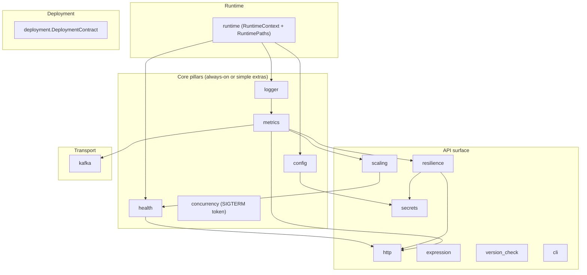

# Architecture

How the pieces fit. Read [README.md](README.md) for the value
proposition; this page is the module map and dependency graph.

---

## Layering

Three layers, top to bottom:

- **Core pillars** -- config, logger, metrics, health, shutdown. Always
  available (no extras required for `config` / `logger`; `metrics` and
  `health` need their respective extras). Every other module depends on
  one or more of these.
- **Runtime** -- environment detection (K8s / Docker / BareMetal) and
  container-aware paths. Used by core pillars to pick log format,
  metric defaults, probe wiring, and config file locations.
- **API surface** -- composable modules apps wire as needed: HTTP,
  secrets, expression, resilience, concurrency,
  version-check, scaling, CLI. Each is independent of the
  others; pick what you need.

Sibling concerns:

- **Transport** -- Kafka producer/consumer/admin (sync + async wrappers).
- **Deployment** -- `DeploymentContract` Pydantic model and the
  Dockerfile / Helm / ArgoCD / Compose generators.

---

## Module dependency graph

Solid arrows: hard dependency (module on left used by module on right).

Observations:

- Every module above the runtime layer depends on at least one core
  pillar. Apps that just want config + logs install nothing else and
  stop here.
- `resilience` is the only cross-cutting API-surface module: a
  hand-rolled `CircuitBreaker`, with stamina providing retry in the
  HTTP client. (An earlier design promised a `with_resilience`
  decorator - it was never built; wrap calls explicitly.)
- `metrics` is the second cross-cutting one: anything that does I/O
  emits counters/histograms when metrics is installed.

---

## Module map

Each module under `src/scalo/` and what you import from it:

| Module | Public API entry |
|---|---|
| `cli` | `ServiceApp`, standard options, common patterns |
| `concurrency` | `run_blocking`, `Bulkhead`, `gather_with_timeouts` |
| `config` | `settings`, `get_environment`, `get_app_name`, `init_config_directory` |
| `data` | data files only -- gitleaks rules + national-ID validators |
| `deployment` | `DeploymentContract`, `generate_*`, `ContractIdentity`, `test_support` |
| `expression` | `evaluate`, `evaluate_condition`, `validate`, `compile_expression` |
| `health` | `HealthManager`, `create_health_router`, probe handlers |
| `http` | `HttpClient`, `AsyncHttpClient` |
| `kafka` | `KafkaProducer`, `KafkaConsumer`, `AsyncKafka*`, `KafkaAdmin`, `SchemaAnalyser` |
| `logger` | `logger`, convenience fns, `scrub/` package |
| `metrics` | `create_metrics`, `groups/*`, `CardinalityTracker` |
| `resilience` | `CircuitBreaker`, `CircuitBreakerConfig` |
| `runtime` | `get_runtime_paths`, `RuntimePaths`, `RuntimeEnvironment` |
| `scaling` | `ScalingPressure`, `ScalingPressureConfig`, `PressureSnapshot` |
| `secrets` | `SecretsManager`, providers (file/openbao/aws/gcp/azure/ansible-vault) |
| `version_check` | `check_on_startup`, `VersionCheckConfig` |

The `Application` framework was removed to backlog (see the note in
`src/scalo/__init__.py`) -- compose modules directly.

---

## What's not here vs scalo-rs

scalo-rs ships several modules scalo-py does not, by design:

- `transport/` abstraction layer (scalo-rs has Kafka, gRPC, HTTP,
  File, Pipe, Memory transports behind a single trait). Pylib has Kafka
  only; no abstraction layer planned.
- `pipeline/` -- BatchEngine, WorkerPool, TieredSink, Spool, DLQ,
  STRmatch. None of these exist in scalo-py. Python's async model + GIL
  make the hot-path concurrency story different; we use
  `concurrency.gather_with_timeouts` for the simple cases.
- `tracing` as a distinct module. Pylib emits structured log fields
  but does not currently wire W3C `traceparent` propagation across
  modules. Tracking issue: when this lands, it'll get a
  `core-pillars/TRACING.md`.

What scalo-py has that scalo-rs doesn't:

- `expression/` CEL bindings via PyO3 to `cel-interpreter` Rust crate
  so Python and Rust services evaluate the same expressions
  byte-identically.

---

## Naming parity with scalo-rs

| Concept | scalo-rs | scalo-py |
|---|---|---|
| Runtime entry point | `ServiceRuntime` + service trait | `Application` (deprecated; compose modules directly) |
| HTTP client | `reqwest` + retry | `httpx` + stamina retry |
| Circuit breaker | hand-rolled `tiered_sink::CircuitBreaker` | hand-rolled `resilience.CircuitBreaker` |
| Retry | `stamina` (Rust crate) | `stamina` (Python PyPI) |
| Config | `figment` 7-layer | `dynaconf` 7-layer |
| Logger | `tracing` | `loguru` |
| Metrics | `metrics` crate + `prometheus-exporter` | `prometheus-client` + `opentelemetry-*` |
| CLI | `clap` + `cli/app.rs` | `typer` + `cli/app.py` |
| Expression | `cel-interpreter` direct | `common-expression-language` (PyO3 wrapper around `cel-interpreter`) |

The doc subdirs match where the concept maps 1:1. Where scalo-py lacks
the concept (`transport/` abstraction, `pipeline/`), the subdir is
absent rather than carrying placeholder files.

---

## Related

- [README.md](README.md)
- [INTEGRATION.md](INTEGRATION.md)
- [AUTO-WIRING.md](AUTO-WIRING.md)
- [EXTRAS-FLAGS.md](EXTRAS-FLAGS.md)
- [runtime/RUNTIME-CONTEXT.md](runtime/RUNTIME-CONTEXT.md)
