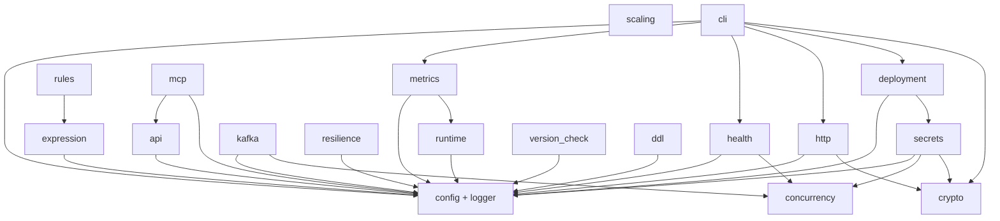

# Architecture

How the pieces fit. Read [README.md](README.md) for the value proposition. This page is the module map and the import graph.

---

## Layering

Three layers, top to bottom:

- Core: `config` and `logger`, always installed and importing each other. Nearly every other module imports one or both.
- Runtime: environment detection (K8s / Docker / BareMetal) and container-aware paths. `config` runs its own container detection at import, which `runtime` reuses, and `metrics` reads `RuntimeEnvironment` for its container gauges.
- Feature modules: what an app wires as needed: metrics, health, HTTP, secrets, expression and rules, resilience, concurrency, version-check, scaling, the CLI, API conventions and MCP. Most stand alone. `cli` imports `metrics`, `health`, `http` and `deployment`, `mcp` imports `api`, and `rules` imports `expression`.

Sibling concerns:

- Transport: Kafka producer/consumer/admin (sync + async wrappers).
- Deployment: `DeploymentContract` Pydantic model and the Dockerfile / container manifest / Compose / ArgoCD AppProject generators. The scalo-service chart renders the Kubernetes objects from the serialised contract.

`health` needs no extra: `HealthManager` and the observability listener run on the base install, and only `create_health_router` needs FastAPI.

---

## Module import graph

An arrow points from a module to one it imports, at module level or inside a function. Private helpers (`_env_compat`, `_yaml`, `_openapi`, `otel_backoff`, `otel_tracing`) are left out.

```mermaid
flowchart TB
    Core["config + logger"]
    Runtime["runtime"]
    Metrics["metrics"]
    Health["health"]
    Conc["concurrency"]
    Crypto["crypto"]
    HTTP["http"]
    Secrets["secrets"]
    Kafka["kafka"]
    Resil["resilience"]
    Scal["scaling"]
    Expr["expression"]
    Rules["rules"]
    API["api"]
    MCP["mcp"]
    CLI["cli"]
    Deploy["deployment"]
    VC["version_check"]
    DDL["ddl"]

    Runtime --> Core
    Metrics --> Core
    Metrics --> Runtime
    Health --> Core
    Health --> Conc
    HTTP --> Core
    HTTP --> Crypto
    Secrets --> Core
    Secrets --> Conc
    Secrets --> Crypto
    Kafka --> Core
    Kafka --> Conc
    Resil --> Core
    Expr --> Core
    Rules --> Expr
    API --> Core
    MCP --> API
    MCP --> Core
    CLI --> Core
    CLI --> Metrics
    CLI --> Health
    CLI --> HTTP
    CLI --> Deploy
    CLI --> Crypto
    Deploy --> Core
    Deploy --> Secrets
    VC --> Core
    DDL --> Core
```

`scaling` and `concurrency` import nothing from scalo. `resilience` is a hand-rolled `CircuitBreaker` and `ReconnectingResilience` that nothing else in scalo imports, so wrap a call in one yourself. The HTTP client retries with stamina and carries no breaker.

---

## Module map

Each module under `src/scalo/` and what you import from it:

| Module | Public API entry |
|---|---|
| `api` | `Hierarchy`, `install`, `scalo_extra`, `permission`, `PreconditionHeaders`, `ListParams`, `Page`, `ProblemError`, `assert_conformant` (the `api` extra) |
| `cli` | `ServiceApp`, `CommonArgs`, `VersionInfo`, re-exported Typer types, and `cli.openapi`, a CLI built from a spec (the `cli` extra) |
| `concurrency` | `run_blocking`, `make_async`, `Bulkhead`, `gather_with_timeouts` |
| `config` | `settings`, `get_config`, `get_environment`, `get_app_name`, `init_config_directory`, `ConfigReloader`, `DirectoryConfigStore` |
| `crypto` | `CryptoProfile`, `ssl_context`, the TLS policy the HTTP client and secrets providers share |
| `data` | data files only -- gitleaks rules and national-ID definitions |
| `ddl` | `EngineResolver`, `parse_engine`: ClickHouse table-engine selection |
| `deployment` | `DeploymentContract`, `generate_*`, `ContractIdentity`, `test_support` |
| `expression` | `evaluate`, `evaluate_condition`, `validate`, `compile_expression` |
| `health` | `HealthManager`, `create_health_router`, `serve_observability` |
| `http` | `HttpClient`, `AsyncHttpClient` |
| `kafka` | `KafkaProducer`, `KafkaConsumer`, `AsyncKafka*`, `KafkaAdmin`, `SchemaAnalyser` |
| `logger` | `logger`, convenience fns, `scrub/` package |
| `mcp` | `mount`, `McpServer`, `tools_from_spec` (the `mcp` extra) |
| `metrics` | `create_metrics`, `groups/*`, `CardinalityTracker` |
| `resilience` | `CircuitBreaker`, `CircuitBreakerConfig`, `ReconnectingResilience` |
| `rules` | `RuleSet`, `Clamp`, `RuleUsage` |
| `runtime` | `get_runtime_paths`, `RuntimePaths`, `RuntimeEnvironment` |
| `scaling` | `ScalingPressure`, `ScalingPressureConfig`, `PressureSnapshot` |
| `secrets` | `SecretsManager`, providers (file/openbao/aws/gcp/azure/kubernetes) |
| `version_check` | `check_on_startup`, `VersionCheckConfig` |

---

## What's not here vs scalo-rs

scalo-rs ships pieces scalo-py does not, by design:

- A transport layer: Kafka, gRPC, HTTP, File, Pipe and Memory transports behind its `TransportSender` and `TransportReceiver` traits. scalo-py has Kafka clients and no transport abstraction.
- The pieces its `docs/pipeline/` covers: `BatchEngine`, `WorkerPool`, `TieredSink`, `Spool`, DLQ and STRmatch. Python's async model and the GIL make the hot-path concurrency story different, so scalo-py has `concurrency.gather_with_timeouts` for the simple cases.

scalo-py has pieces scalo-rs does not: `api` (FastAPI conventions), `mcp`, and `cli.openapi`.

---

## Naming parity with scalo-rs

| Concept | scalo-rs | scalo-py |
|---|---|---|
| Runtime entry point | `ServiceApp` trait + `ServiceRuntime` | `ServiceApp` base class |
| HTTP client | `reqwest` + `backon` retry | `httpx` + stamina retry |
| Circuit breaker | hand-rolled `tiered_sink::CircuitBreaker` | hand-rolled `resilience.CircuitBreaker` |
| Config | `figment` 7-layer | `dynaconf` 7-layer |
| Logger | `tracing` | `loguru` |
| Metrics | `metrics` crate + `metrics-exporter-prometheus` + OTel | `prometheus-client` + `opentelemetry-*` |
| CLI | `clap` + `cli/app.rs` | `typer` + `cli/app.py` |
| Expression | the `cel` crate (cel-rust) | `common-expression-language`, Python bindings built on the same crate |

The doc subdirs match where the concept maps 1:1. Where scalo-py lacks the concept, the subdir is absent: there is no `pipeline/`, and `transport/` covers Kafka only.

---

## Related

- [README.md](README.md)
- [integration.md](integration.md)
- [auto-wiring.md](auto-wiring.md)
- [extras-flags.md](extras-flags.md)
- [runtime/runtime-context.md](runtime/runtime-context.md)
