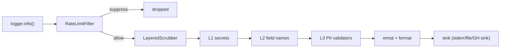

# Logger

Loguru-backed structured logging with RFC 3339 timestamps, layered
secret scrubbing, rate-limiting, and CI-aware output formatting.
Import the logger, log, and the message goes through the scrub
pipeline, the rate-limit filter, and finally a sink chosen by the
detected runtime (TTY, container, or CI). No `logging.basicConfig`,
no `dictConfig`, no per-service boilerplate.

```python
from scalo.logger import logger, info, error

info("service started", version="2.28.3")
logger.bind(component="kafka_consumer").info("subscribed", topic="events")

try:
    process()
except Exception:
    error("processing failed", retries=3)
```

---

## Format selection

The console sink writes JSON or text. The first concrete selector wins: the `log_format` argument (`--log-format` on a `ServiceApp`), then `LOG_FORMAT`, then `logging.format`. `auto`, blank and unrecognised values defer to the next one.

| Selector | Output |
|----------|--------|
| `json` | One flat JSON object per line, see [JSON records](#json-records) |
| `text` | A human-readable line with the fields as `key=value`; `console`, `pretty` and `human` are aliases |
| `auto`, or nothing set | JSON when `OTEL_EXPORTER_OTLP_ENDPOINT` is set, text in CI, text when stderr is a TTY, JSON otherwise |

So a service in a container logs JSON with no configuration, and the same code in a terminal logs text. An unrecognised value is treated as `auto` and reported with a warning once the sinks are up. `json`, `text`, `pretty`, `human` and `auto` are also the values scalo-rs accepts; `console` is scalo-py only.

Set `NO_LOGGER_CONFIG=1` to disable auto-configuration if you need to wire Loguru yourself.

---

## Fields

Keyword arguments and `logger.bind()` context are the record's fields, and every format renders them.

- Text appends them after the message as `key=value`. A value is quoted, JSON-style, when it is empty or holds a space, `=`, `"` or a control character. Non-string values render as JSON: `true`, `null`, `3`. A record with no fields gets nothing appended.
- JSON puts them under `fields`.

```text
2026-10-01T20:47:42.256+1000 | WARNING  | app.tls:load:7 - key rejected stderr="openssl: bad key" sigma_id=abc123
```

The scrub filter runs on the fields before either format sees them. A sensitive key masks its value at any depth, strings are scrubbed at any depth, and any other object is rendered with `str()` and then scrubbed.

---

## JSON records

```json
{"timestamp": "2026-10-01T10:47:34.727003Z", "level": "WARNING", "target": "app.tls", "function": "load", "line_number": 7, "message": "key rejected", "fields": {"stderr": "openssl: bad key", "sigma_id": "abc123"}}
```

| Key | Content |
|-----|---------|
| `timestamp` | RFC 3339 in UTC, microseconds |
| `level` | loguru level name: `TRACE`, `DEBUG`, `INFO`, `SUCCESS`, `WARNING`, `ERROR`, `CRITICAL` |
| `target` | Logger name: the calling module |
| `function`, `line_number` | Call site |
| `message` | The scrubbed message, emojis as ASCII tokens |
| `fields` | The record's fields as an object, `{}` when there are none |
| `exception` | The formatted traceback, present only when one was logged |

Fields sit under one key so a field named `level` or `message` cannot overwrite the record's own. `timestamp`, `level`, `target`, `line_number` and `fields` are the keys scalo-rs writes too. scalo-rs differs in three places: `message` sits inside `fields`, there is no `function`, and a warning is `WARN`.

---

## Colour

Text is coloured only when stderr is a TTY. `LOG_COLOR` (`true`/`false`) wins, then `NO_COLOR` (set to anything turns colour off), then `logging.color`, then the TTY check. JSON and CI output are never coloured.

---

## Environment knobs

```bash
LOG_LEVEL=DEBUG              # DEBUG, INFO, WARNING, ERROR, CRITICAL
LOG_FORMAT=json              # json, text, auto (console, pretty, human mean text)
LOG_COLOR=false              # true/false; NO_COLOR=1 also turns colour off
LOG_ENQUEUE=0                # Sync sinks (default: fire-and-forget)
```

`logging.intercept_stdlib` (default `true`) is read from config, see [Stdlib logging](#stdlib-logging). `get_logging_config()` also reads `LOG_OUTPUT`, `LOG_TIMESTAMP_FORMAT`, `LOG_CALLER` and `LOG_STACKTRACE_LEVEL`, but `setup()` does not apply them: the console sink always writes to stderr, with RFC 3339 timestamps and the call site.

`NO_LOGGER_CONFIG` and `LOG_ENQUEUE` are scalo control vars, so they
take the app's env prefix like every other one: bare by default,
`<PREFIX>_LOG_ENQUEUE` when the app sets one. There is no `HYPERI_`
form -- scalo hard-codes no brand.

The same keys live under `logging:` in `settings.yaml` and follow the
[CONFIG cascade](CONFIG.md#the-cascade).

---

## Where the level comes from

On the `ServiceApp` path, highest first:

1. `--verbose` / `--quiet`
2. `--log-level` (Typer also fills this from `LOG_LEVEL`)
3. `logging.level` in the config cascade
4. `INFO`

`--log-level` and `--log-format` carry no default, deliberately: a
default is indistinguishable from an explicit flag, so one would outrank
the cascade permanently. Same reason scalo-rs dropped its clap defaults.

This is why `run` and `config-check` load config BEFORE building the
logger. The logger's level, format and span exporter all come from the
cascade, so building it first left every one of them reachable only from
a flag or an env var. The cost is that anything the cascade itself logs
on the way up has no scalo sink yet; it is DEBUG-gated, and the resolved
config path is reported straight after.

---

## Library loggers

`setup()` raises the stdlib `boto3`, `botocore`, `s3transfer` and `urllib3`
loggers to WARNING, whatever `level` is. At DEBUG botocore writes request
params and response bodies, and a Secrets Manager `SecretString` is one of
them. A level the app already set higher is left alone.

Need their DEBUG output? Set the logger's level yourself AFTER `setup()`,
and only where nothing reads a secret.

---

## Stdlib logging

Libraries that log through the stdlib `logging` module -- uvicorn, clickhouse_connect, botocore, and scalo's own secrets and config reloader -- go through the same sinks. `setup()` makes the root logger's only handler one that re-emits each record through loguru, so it gets the same format, the same scrubbing, and its `extra=` dict as fields. The call site reported is the library's, not the handler's.

- The root logger's other handlers are removed, so nothing is written twice. The root level follows `level`.
- `uvicorn`, `uvicorn.error` and `uvicorn.access` lose their own handlers and propagate.
- uvicorn reattaches its handlers whenever a `uvicorn.Config` is built, so build it with `log_config=None` after `setup()`.

It is on by default. Turn it off with `logging.intercept_stdlib: false` or `setup(intercept_stdlib=False)`; that also removes a handler an earlier `setup()` installed.

---

## CI autodetect

`setup()` switches to ASCII-only output and disables colours when any
of these are set: `CI=true`, `GITHUB_ACTIONS=true`, `GITLAB_CI=true`,
`JENKINS_URL`, `CIRCLECI=true`, `TRAVIS=true`. GitHub Actions gets a
custom sink that emits workflow commands -- `::error::`, `::warning::`,
`::debug::` -- so log messages annotate the run UI.

CI mode also implies `use_emojis=False`. Override via `setup(ci_mode=False)`
if you really need colours in CI. CI turns `auto` into text; an explicit
`json` still writes JSON.

---

## Emoji-to-text

CHARS-POLICY-approved emojis (✅ ❌ ⚠️ 💥) are added to console output
when the terminal supports UTF-8. For file sinks, CI mode, and
machine-readable formats, emojis are converted to ASCII tokens:

| Emoji | ASCII |
|-------|-------|
| 💥 | `[FATAL]` |
| ❌ | `[ERROR]` |
| ⚠️ | `[WARN]` |
| ✅ | `[SUCCESS]` |
| 🟢 | `[PASS]` |
| 🔴 | `[FAIL]` |
| 🔁 | `[RETRY]` |

The conversion table lives in `logger.EMOJI_TO_TEXT`; use
`emojis_to_text()` or `strip_emojis()` directly when needed.

---

## Scrub architecture

Three layers fire in order on every log message. Built from
`logger.scrub` package, configured via `ScrubConfig`, composed by
`build_scrubber()`:

| Layer | Source | Detects |
|-------|--------|---------|
| L1 secrets | `scrub/secrets.py` + `gitleaks.toml` rules | AWS keys, GitHub tokens, JWTs, private keys, third-party API keys |
| L2 fields | `scrub/field_names.py` (regex on key names) | `password=...`, `"token":"..."`, `CARGO_REGISTRY_TOKEN=...`, `token = "..."`, bearer tokens, DB URLs |
| L3 PII | `scrub/pii/` validators (Luhn, mod-97, libphonenumber) | Credit cards, IBANs, emails, phones, AU ABN, AU TFN |

There is no L4 -- NLP/NER scrubbing was dropped from scope (the
false-positive rate on logs was unacceptable, and per-call cost of
5-200ms broke structured-log budgets). The L1 rule set is the
gitleaks TOML vendored from hyperi-ai, parsed by
`scrub/gitleaks_toml.py`. The composed scrubber is selected by
`scrub_resolver.py`, which honours (in order): explicit `scrubber=`
arg, explicit `scrub_config=` arg, legacy `mask_sensitive`/
`masking_level` args, new `logging.scrub.*` config keys, legacy
`logging.mask_sensitive_data` config keys, then defaults.

```python
from scalo.logger import setup
from scalo.logger.scrub import ScrubConfig, build_scrubber

scrubber = build_scrubber(ScrubConfig(
    hash_redaction=True,    # ***REDACTED:a3f2*** lets you correlate without leaking
))
setup(scrubber=scrubber)
```

### Excluding one L1 rule

L1 runs every gitleaks rule over log prose, where a broad rule can match ordinary text. `generic-api-key` is the one known to: it turns `Renamed config keys in .hyperi-ci.yaml: publish.container -> ...` into `Renamed config [GENERIC_API_KEY_REDACTED]-> ...`. Drop the offending rule by id and keep the rest of the set running:

```yaml
logging:
  scrub:
    secrets:
      exclude_rules: [generic-api-key]   # a comma-separated string also works, for env vars
```

```python
from scalo.logger import setup
from scalo.logger.scrub import ScrubConfig, SecretsConfig

setup(scrub_config=ScrubConfig(secrets=SecretsConfig(exclude_rules=frozenset({"generic-api-key"}))))
```

The specific rules still catch the credential shapes, so a real GitHub token is still `[GITHUB_PAT_REDACTED]` with `generic-api-key` excluded. L2 still masks by key name, so `CARGO_REGISTRY_TOKEN=...` and `token = "..."` stay masked too. Do not reach for `patterns: minimal` to silence a false positive: it keeps 13 rules and drops cloudflare, npm and pypi detection with it.

An id the rule set does not carry raises a `RuntimeWarning` at startup and excludes nothing. `exclude_rules` applies to `patterns: gitleaks` and `patterns: minimal`; the `detect-secrets` path warns and ignores it. The `logging.scrub.*` keys are read only when `setup()` gets no `mask_sensitive` or `masking_level` argument -- either one selects the legacy mapping and ignores them, so pass `scrub_config=` instead.

### Layer 2 field-name regex

A listed field masks the value when it ENDS the key and no letter or digit comes before it. So `CARGO_REGISTRY_TOKEN=...` and `JFROG_TOKEN=...` mask on `token`, and `R2_SECRET_ACCESS_KEY=...` on `secret_access_key`. A key that runs on past the field does not match: `token_count=5`, `max_tokens=4096` and `tokenizer` pass through, while `max_token=5` is masked. Matching is case-insensitive.

| Shape | Input | Output |
|-------|-------|--------|
| env, form data | `JFROG_TOKEN=abc` | `JFROG_TOKEN=***REDACTED***` |
| TOML, INI | `token = "abc def"` | `token = ***REDACTED***` |
| JSON | `{"CARGO_REGISTRY_TOKEN": "abc"}` | `{"CARGO_REGISTRY_TOKEN": "***REDACTED***"}` |
| Python repr | `{'password': 'abc'}` | `{'password': ***REDACTED***}` |
| YAML, HTTP header | `x-auth-token: abc` | `x-auth-token: ***REDACTED***` |

A quoted value after `=`, or a single-quoted one after `:`, is masked whole with its quotes. A double-quoted JSON value keeps its quotes so the line stays valid JSON. Whitespace around `=` never crosses a line, and `==` and `=>` are not read as assignments.

The legacy `SensitiveDataFilter` in `logger.filters` ships the L2
field set as a backwards-compatible shim. Add custom fields with
`SensitiveDataFilter.add_sensitive_fields({"employee_id", "ssn"})`.

---

## Rate limiting

`RateLimitFilter` suppresses identical messages from tight loops and
reports the suppressed count when logging resumes:

```python
from scalo.logger import setup

setup(rate_limit_sec=30, rate_limit_similar=True)

for order_id in range(1000):
    logger.error(f"Failed to process order {order_id}")
# First message fires; the next 999 are suppressed.
# When the period elapses, the next message includes
# "(suppressed 999 similar)".
```

`rate_limit_similar=True` normalises UUIDs, ISO timestamps, IP
addresses, hex strings, and large numbers before matching, so
messages differing only in IDs collapse to one.

---

## Async safety

Sinks default to fire-and-forget (`enqueue=True` on Loguru) -- log
calls return in microseconds even with slow disk or network sinks.
Set `LOG_ENQUEUE=0` for synchronous behaviour, which audit
logs and pytest fixtures asserting on captured output need.

---

## Lifecycle



---

## Related

- [CONFIG.md](CONFIG.md) -- shares the sensitive-field list and cascade
- [METRICS.md](METRICS.md) -- scrub metrics surface as `log_scrub_*`
- [HEALTH.md](HEALTH.md) -- probes log via the same logger
- [SHUTDOWN.md](SHUTDOWN.md) -- log flush on SIGTERM
- [api/CLI.md](../api/CLI.md) -- CLI integrates the CI autodetect
- [EXTRAS-FLAGS.md](../EXTRAS-FLAGS.md) -- scrub deps ship in base; no extras needed
